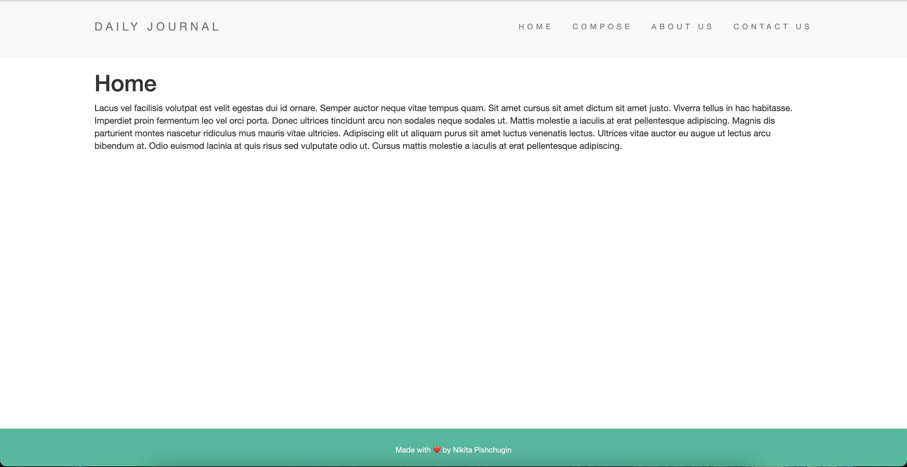
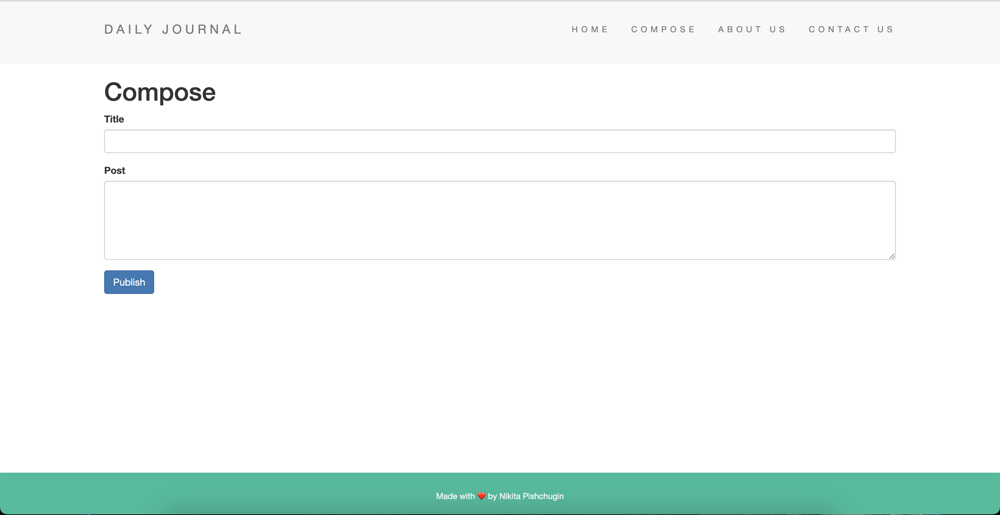
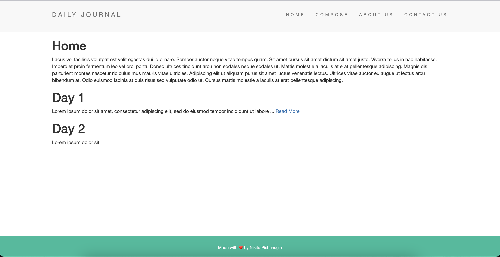
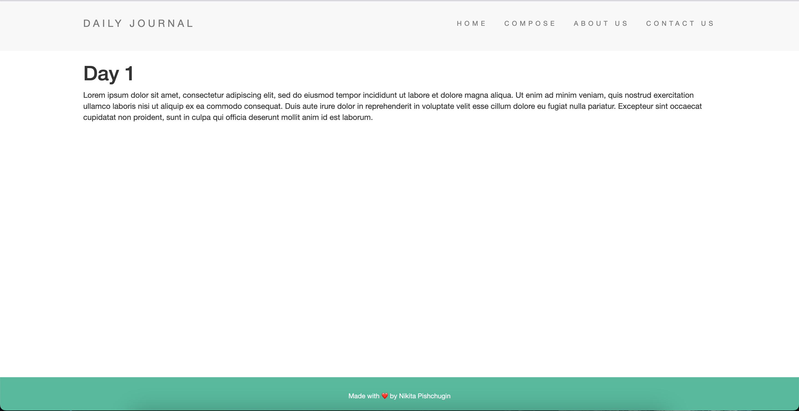

# Blog_Website

Small project I made while was studying on Udemy (The Complete 2022 Web Development Bootcamp)

## Home Screen 

## Compose Screen

## Home Screen with new posts

## Post screen. You can open it if the number of characters in the paragraph is greater than 100

